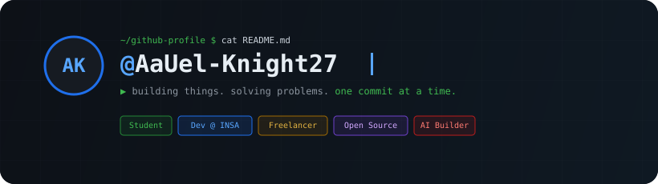
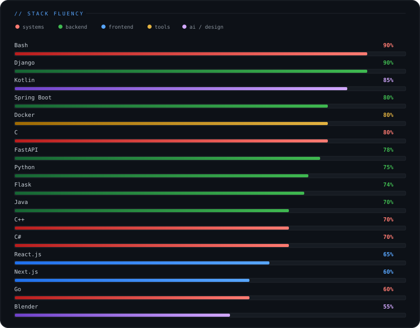

# AaUel-Knight27
> `https://raw.githubusercontent.com/AaUel-Knight27/AaUel-Knight27/main/photo.jpg`

<p align="center">
  
</p>

## Who I Am

```python
class AaUel_Knight27:
    role       = ["Student", "Developer @ INSA", "Freelancer"]
    focus      = ["building things", "solving problems"]

    languages  = ["Python", "Java", "Kotlin", "Go", "Bash", "C", "C++", "C#", "TypeScript", "Ruby", "SQL"]
    frameworks = ["Django", "Spring Boot", "FastAPI", "Flask", "React.js", "Next.js", "Hibernate", "JPA"]
    systems    = ["Linux", "Docker", "Git", "CI/CD", "REST", "GraphQL", "gRPC"]
    ai         = ["LLMs", "RAG", "agent pipelines", "prompt engineering", "vector DBs"]
    design     = ["Blender", "system architecture", "microservices", "clean arch", "MVC"]
    databases  = ["PostgreSQL", "MySQL", "SQLite", "MongoDB", "Redis", "FAISS"]

    open_to    = ["collaborations", "freelance work", "interesting problems"]
```

## Projects

<p align="center">
  <sub>Auto-syncs from your pinned repositories on GitHub.</sub>
</p>

<!-- PINNED_PROJECTS:START -->
|  |  |
| --- | --- |
| [](https://github.com/AaUel-Knight27/AaUel-Knight27/actions) |  |
<!-- PINNED_PROJECTS:END -->

## Stack Fluency

<p align="center">
  
</p>

## Tech Universe

**LANGUAGES**


**FRAMEWORKS**


**DATABASES**


**TOOLS & PLATFORM**


**ARCHITECTURE & DESIGN**


**AI & SECURITY**


## Activity

<p align="center">
  
</p>

<p align="center">
  
  
</p>

## Reach Me

[](https://x.com/aethele87)
[](https://www.linkedin.com/in/abel-alemayehu-a0681a3a2/)
[](https://github.com/AaUel-Knight27)

[`@aethele87`](https://x.com/aethele87) | [`Abel Alemayehu`](https://www.linkedin.com/in/abel-alemayehu-a0681a3a2/) | [`AaUel-Knight27`](https://github.com/AaUel-Knight27)

<p align="center"><code>~/github-profile $ echo "thanks for stopping by"</code></p>

<p align="center">crafted in the dark | building &amp; solving | @AaUel-Knight27</p>
